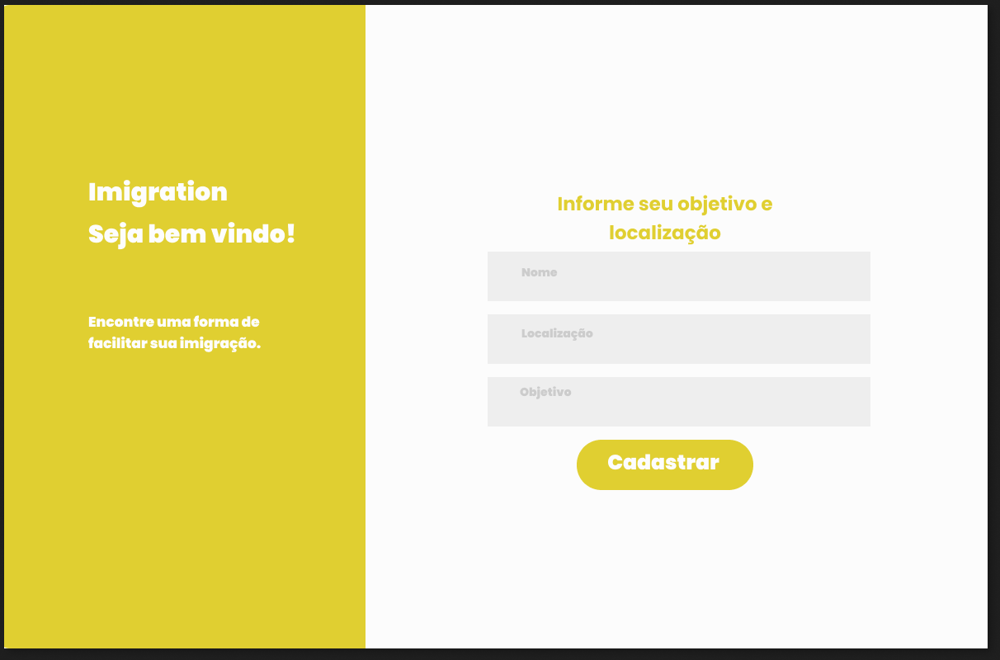
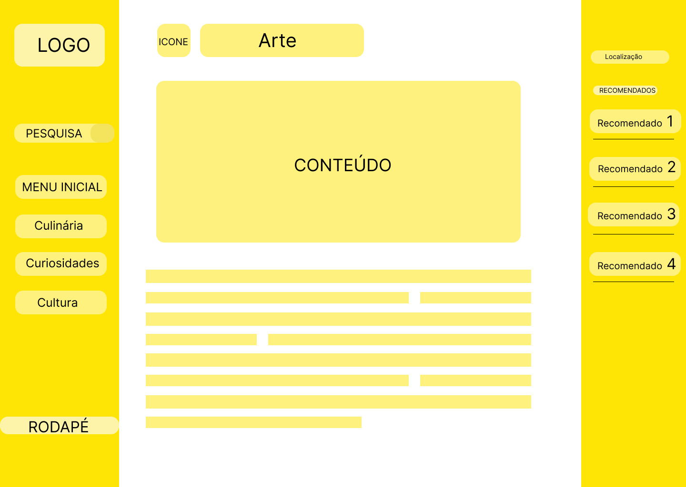

# Projeto de Interface

Visão geral da interação do usuário pelas telas do sistema e protótipo interativo das telas com as funcionalidades que fazem parte do sistema (wireframes).

Temos 6 telas, sendo elas a inicial onde o Usuario vai cadastrar o interesse dele no momento, a tela de home, na qual ele vai poder navegar pelas informações que ele deseja obter e uma para cada tema sobre a informação que ele deseja.

## User Flow

## Wireframes
inicial onde o Usuario vai cadastrar o interesse:

 

tela de home:

Tela de curiosidades:

Tela de cultura:

Tela de arte:

Tela de culinária:

 
